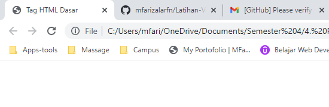
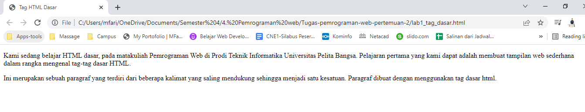
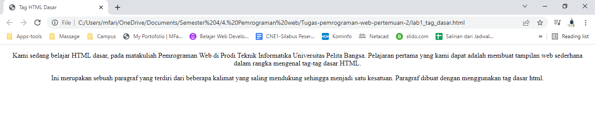

# Tugas pemrograman web pertemuan-2

**Nama  : Mohamad Farizal Arifin**

**Nim   : 312010231**

**Kelas : TI.20.B.1**

Langkah pertama untuk memnuhi tugas ini adalah membuat file baru dengan nama : lab1_tag_dasar
```
<!DOCTYPE html>
<html>
    <head>
        <title>Tag HTML Dasar</title>
    </head>
<body>
        
</body>
</html>
```
<br>

*Berikut untuk hasil source code :* <br>

 <br>

**1. Membuat paragraf**
<br>
Pada paragraf saya akan menambahkan sebuah kalimat :<br>
Kami sedang belajar HTML dasar, pada matakuliah Pemrograman Web di Prodi
Teknik Informatika Universitas Pelita Bangsa. Pelajaran pertama yang kami dapat adalah membuat tampilan web sederhana dalam rangka mengenal tag-tag dasar HTML.<br>

Ini merupakan sebuah paragraf yang terdiri dari beberapa kalimat yang saling
mendukung sehingga menjadi satu kesatuan. Paragraf dibuat dengan menggunakan
tag dasar html.<br>

*Berikut source code :*<br>
```
<!DOCTYPE html>
<html>
    <head>
        <title>Tag HTML Dasar</title>
    </head>
<body>
    <p>Kami sedang belajar HTML dasar, pada matakuliah Pemrograman Web di Prodi 
    Teknik Informatika Universitas Pelita Bangsa. Pelajaran pertama yang kami dapat
    adalah membuat tampilan web sederhana dalam rangka mengenal tag-tag dasar HTML.</p>

    <p>Ini merupakan sebuah paragraf yang terdiri dari beberapa kalimat yang saling
    mendukung sehingga menjadi satu kesatuan. Paragraf dibuat dengan menggunakan
    tag dasar html.</p>
</body>
</html>
```
<br>

*Hasil setelah saya tambahkan paragraf :*<br>

 <br>

**Merubah perataan paragraf**
<br>
Setelah membuat paragraf selanjutnya saya akan mengatur atau merubah pertaan untuk paragraf tersebut :<br>

*Berikut source code :*<br>
```
<!DOCTYPE html>
<html>
    <head>
        <title>Tag HTML Dasar</title>
    </head>
<body>
    <p align="center">Kami sedang belajar HTML dasar, pada matakuliah Pemrograman Web di Prodi 
    Teknik Informatika Universitas Pelita Bangsa. Pelajaran pertama yang kami dapat
    adalah membuat tampilan web sederhana dalam rangka mengenal tag-tag dasar HTML.</p>

    <p align="center">Ini merupakan sebuah paragraf yang terdiri dari beberapa kalimat yang saling
    mendukung sehingga menjadi satu kesatuan. Paragraf dibuat dengan menggunakan
    tag dasar html.</p>
</body>
</html>
```
<br>

*Hasil setelah merubah perataan :*<br>
 <br>