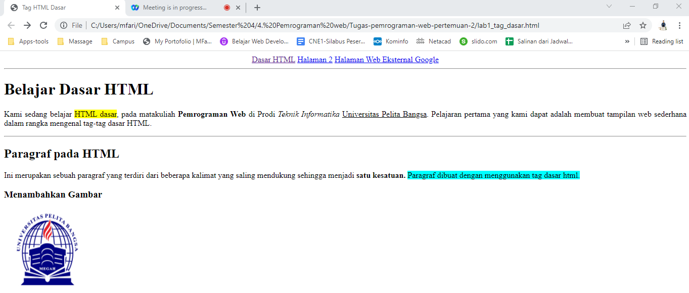

# Tugas pemrograman web pertemuan-2

**Nama  : Mohamad Farizal Arifin**

**Nim   : 312010231**

**Kelas : TI.20.B.1**

Langkah pertama untuk memenuhi tugas ini adalah membuat file baru dengan nama : lab1_tag_dasar
```
<!DOCTYPE html>
<html>
    <head>
        <title>Tag HTML Dasar</title>
    </head>
<body>
        
</body>
</html>
```
<br>

*Berikut untuk hasil source code :* <br>

 <br>

**1. Membuat paragraf**
<br>
Pada paragraf saya akan menambahkan sebuah kalimat :<br>
Kami sedang belajar HTML dasar, pada matakuliah Pemrograman Web di Prodi
Teknik Informatika Universitas Pelita Bangsa. Pelajaran pertama yang kami dapat adalah membuat tampilan web sederhana dalam rangka mengenal tag-tag dasar HTML.<br>

Ini merupakan sebuah paragraf yang terdiri dari beberapa kalimat yang saling
mendukung sehingga menjadi satu kesatuan. Paragraf dibuat dengan menggunakan
tag dasar html.<br>

*Berikut source code :*<br>
```
<!DOCTYPE html>
<html>
    <head>
        <title>Tag HTML Dasar</title>
    </head>
<body>
    <p>Kami sedang belajar HTML dasar, pada matakuliah Pemrograman Web di Prodi 
    Teknik Informatika Universitas Pelita Bangsa. Pelajaran pertama yang kami dapat
    adalah membuat tampilan web sederhana dalam rangka mengenal tag-tag dasar HTML.</p>

    <p>Ini merupakan sebuah paragraf yang terdiri dari beberapa kalimat yang saling
    mendukung sehingga menjadi satu kesatuan. Paragraf dibuat dengan menggunakan
    tag dasar html.</p>
</body>
</html>
```
<br>

*Hasil setelah saya tambahkan paragraf :*<br>

 <br>

**Merubah perataan paragraf**
<br>
Setelah membuat paragraf selanjutnya saya akan mengatur atau merubah pertaan untuk paragraf tersebut :<br>

*Berikut source code :*<br>
```
<!DOCTYPE html>
<html>
    <head>
        <title>Tag HTML Dasar</title>
    </head>
<body>
    <p align="center">Kami sedang belajar HTML dasar, pada matakuliah Pemrograman Web di Prodi 
    Teknik Informatika Universitas Pelita Bangsa. Pelajaran pertama yang kami dapat
    adalah membuat tampilan web sederhana dalam rangka mengenal tag-tag dasar HTML.</p>

    <p align="center">Ini merupakan sebuah paragraf yang terdiri dari beberapa kalimat yang saling
    mendukung sehingga menjadi satu kesatuan. Paragraf dibuat dengan menggunakan
    tag dasar html.</p>
</body>
</html>
```
<br>

*Hasil setelah merubah perataan :*<br>
 <br>

**2. Menambahkan judul / Heading**
<br>

*Berikut source code :*<br>
```
<!DOCTYPE html>
<html>
    <head>
        <title>Tag HTML Dasar</title>
    </head>
<body>
    <h1>Belajar Dasar HTML</h1>
    <p align="center">Kami sedang belajar HTML dasar, pada matakuliah Pemrograman Web di Prodi 
    Teknik Informatika Universitas Pelita Bangsa. Pelajaran pertama yang kami dapat
    adalah membuat tampilan web sederhana dalam rangka mengenal tag-tag dasar HTML.</p>

    <h2>Paragraf pada HTML</h2>
    <p align="center">Ini merupakan sebuah paragraf yang terdiri dari beberapa kalimat yang saling
    mendukung sehingga menjadi satu kesatuan. Paragraf dibuat dengan menggunakan
    tag dasar html.</p>
</body>
</html>
```
<br>

*Berikut hasil source code setelah menambahkan heading :*<br>
 <br>
<br>

**3. Memformat teks paragraf**
<br>

*Berikut source code :*<br>
```
<!DOCTYPE html>
<html>
    <head>
        <title>Tag HTML Dasar</title>
    </head>
<body>
    <h1>Belajar Dasar HTML</h1>
        <p align="justify">Kami sedang belajar <font style="background-color: yellow;">HTML dasar</font>, pada matakuliah <b>Pemrograman Web</b> di Prodi <i>Teknik Informatika</i> <u>Universitas Pelita Bangsa</u>. Pelajaran pertama yang kami dapat adalah membuat tampilan web sederhana dalam rangka mengenal tag-tag dasar HTML.</p>
    <hr>
    <h2>Paragraf pada HTML</h2>
        <p align="left">Ini merupakan sebuah paragraf yang terdiri dari beberapa kalimat yang saling mendukung sehingga menjadi <b>satu kesatuan.</b> <font style="background-color: aqua;">Paragraf dibuat dengan menggunakan tag dasar html.</font></p>
</body>
</html>
```
<br>

*Berikut hasil source code setelah memformat teks :*<br>
 <br>

**4. Menyisipkan gambar**
<br>

*Berikut source code :*<br>
```
<!DOCTYPE html>
<html>
    <head>
        <title>Tag HTML Dasar</title>
    </head>
<body>
    <h1>Belajar Dasar HTML</h1>
        <p align="justify">Kami sedang belajar <font style="background-color: yellow;">HTML dasar</font>, pada matakuliah <b>Pemrograman Web</b> di Prodi <i>Teknik Informatika</i> <u>Universitas Pelita Bangsa</u>. Pelajaran pertama yang kami dapat adalah membuat tampilan web sederhana dalam rangka mengenal tag-tag dasar HTML.</p>
    <hr>

    <h2>Paragraf pada HTML</h2>
        <p align="left">Ini merupakan sebuah paragraf yang terdiri dari beberapa kalimat yang saling mendukung sehingga menjadi <b>satu kesatuan.</b> <font style="background-color: aqua;">Paragraf dibuat dengan menggunakan tag dasar html.</font></p>

    <h3>Menambahkan Gambar</h3>
    
    </body>
</html>
```
<br>

*Berikut hasil source code setelah menambahkan gambar :*<br>
 <br>
<br>

**5. Menambahkan hyperlink**
<br>

*Berikut source code :*<br>
```
<!DOCTYPE html>
<html>
    <head>
        <title>Tag HTML Dasar</title>
    </head>
<body>
    <div align="center">
        <a href="lab1_tag_dasar.html">Dasar HTML</a>
        <a href="lab1_halaman2.html">Halaman 2</a>
        <a href="http://www.google.com">Halaman Web Eksternal Google</a>
    </div>
    <hr>

    <h1>Belajar Dasar HTML</h1>
        <p align="justify">Kami sedang belajar <font style="background-color: yellow;">HTML dasar</font>, pada matakuliah <b>Pemrograman Web</b> di Prodi <i>Teknik Informatika</i> <u>Universitas Pelita Bangsa</u>. Pelajaran pertama yang kami dapat adalah membuat tampilan web sederhana dalam rangka mengenal tag-tag dasar HTML.</p>
    <hr>

    <h2>Paragraf pada HTML</h2>
        <p align="left">Ini merupakan sebuah paragraf yang terdiri dari beberapa kalimat yang saling mendukung sehingga menjadi <b>satu kesatuan.</b> <font style="background-color: aqua;">Paragraf dibuat dengan menggunakan tag dasar html.</font></p>

    <h3>Menambahkan Gambar</h3>
    
    </body>
</html>
```
<br>

*Berikut hasil source code setelah menambahkan link :*<br>
 <br>
<br>
<br>

**Jawab pertanyaan berikut :**<br>
1. Lakukan perubahan pada kode sesuai dengan keinginan anda, amati perubahannya adakah
error ketika terjadi kesalahan penulisan tag?<br>
2. Apa perbedaan dari tag <p> dengan tag <br>, berikan penjelasannya!<br>
3. Apa perbedaan atribut title dan alt pada tag , berikan penjelasannya!<br>
4. Untuk mengatur ukuran gambar, digunakan atribut width dan height. Agar tampilan gambar
proporsional sebaiknya kedua atribut tersebut diisi semua atau tidak? Berikan penjelasannya!<br>
5. Pada link tambahkan atribut target dengan nilai atribut bervariasi ( _blank, _self, _top,
_parent ), apa yang terjadi pada masing-masing nilai antribut tersebut?<br>